# Операционные системы
# 1 лабораторная
### Реализации факториала на с++
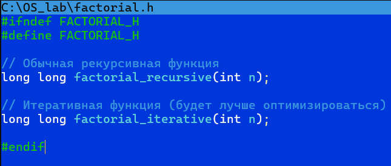

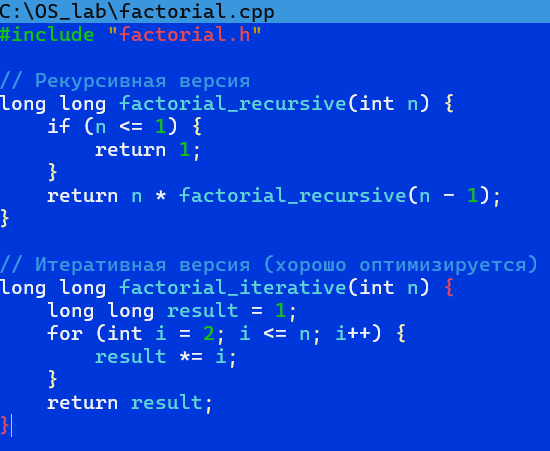

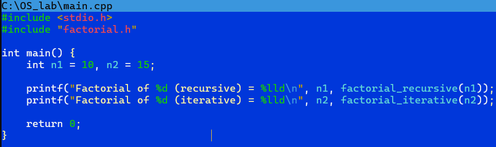
### Makefile
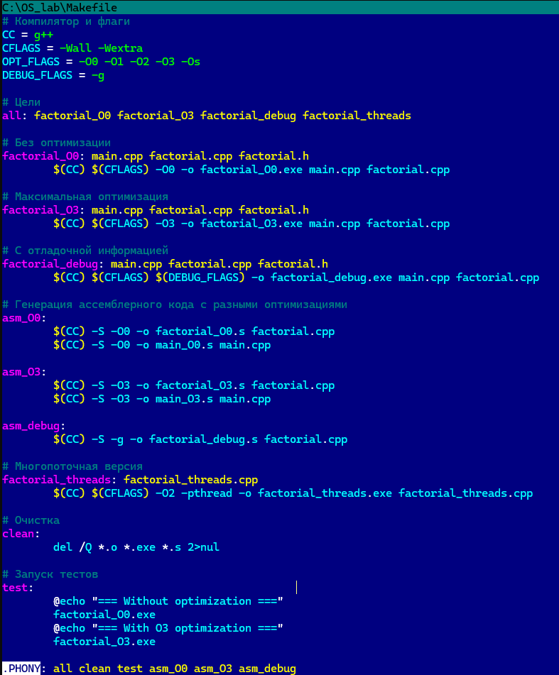
### Многопоточная версия c факториалом 15 и 20.
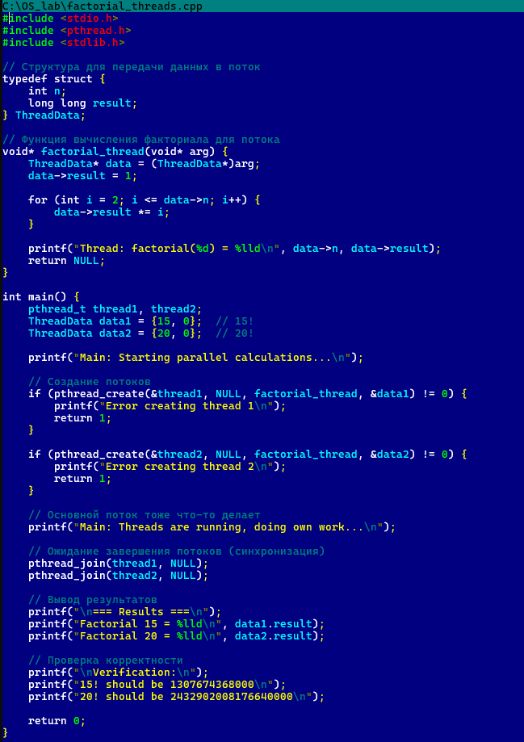

### Проверка на работу кода 
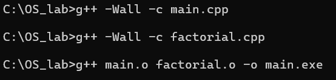

### Компилация в код для ассемблера
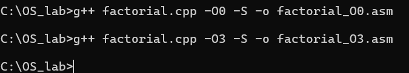

### Без оптимизации
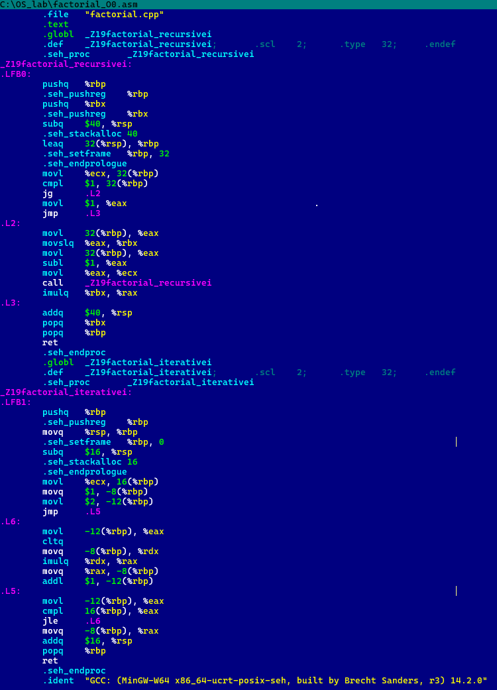

### С -O3 оптимизацией 
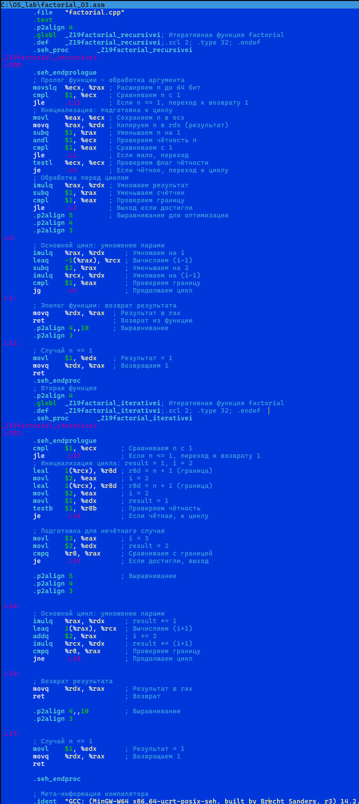
### Переписываем Makefile
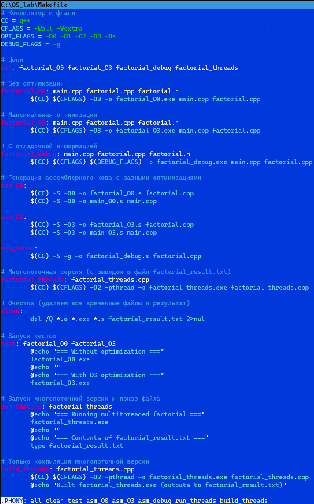

### Запуск Makefile
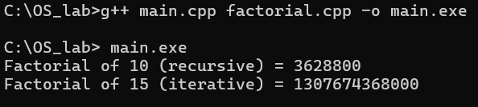

### Переписал файл с многопоточностью 
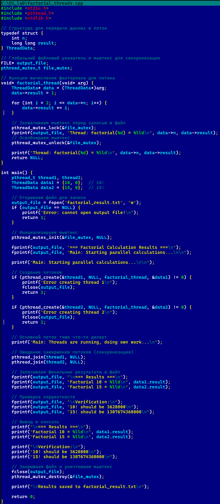

## Лабораторная работа №2
### Создание Виртруальной машины
[Видео здесь](https://github.com/Hanfeiter/laboratoros1/blob/main/2026-05-24%2021-03-07.mp4)

